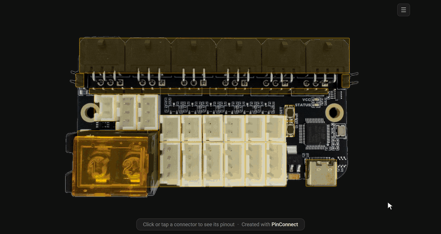

# PinConnect

An interactive pinout generator for PCBs. PinConnect turns a photo of a board into an interactive pinout diagram you can open in a browser or embed in a documentation site.



*A generated pinout for the [Birds' Nest CAN](https://store.isiks.tech/products/birds-nest-CAN) board — hover a connector on the board for its pinout, or open the connector list to browse every connector at once.*

It is made of three tools, used in sequence:

- **pinout-design**: a browser-based designer that turns a board image into a TOML config.
- **pinout-gen**: a CLI that reads that config and generates a self-contained interactive HTML pinout.
- **pinout-embed**: an optional Markdown extension that embeds the generated HTML into MkDocs / Zensical sites.

You only need the first two for a working pinout; the third is for publishing to a Markdown docs site.

If you'd like to see a live demo of the generated pinouts, you can find it on this documentation website: https://docs.isiks.tech/pinouts/bnc/bnc.pinout.html

## Quick start

1. Serve the designer and open it in your browser:

   ```bash
   cd pinout_design
   python -m http.server 8000   # then open http://localhost:8000
   ```

   Load a board image, draw a box over each connector, label the pins, and **Save TOML**.

2. Install the generator and render your config:

   ```bash
   pip install ./pinout_gen
   pinout-gen board.toml         # writes board.pinout.html
   ```

3. (Optional) Embed the result in an MkDocs / Zensical page — see the docs.

Full walkthrough: **[docs/getting-started.md](docs/getting-started.md)**.

## Documentation

All guides live in the [`docs/`](docs/) folder — start with the [documentation index](docs/README.md):

- [Getting Started](docs/getting-started.md)
- [Concepts](docs/concepts.md)
- [pinout-design](docs/pinout-design.md)
- [pinout-gen](docs/pinout-gen/generating-html.md)
- [pinout-embed](docs/pinout-embed/mkdocs-zensical.md)

## Repository layout

- `pinout_design/`: the visual designer (static web app).
- `pinout_gen/`: the `pinout-gen` CLI and connector type library.
- `pinout_embed/`: the Markdown embedding extension.
- `docs/`: documentation.

## Todo

The project works and generates great looking pinouts already. Below are changes/features not implemented yet, planned to be implemented soon:

- Add slide switch as a "connector" for highlighting its positions

## License

This project is licensed under GPL-3.0. See [LICENSE](LICENSE).

If you'd like to support the development of this and other open-source projects, you can donate on [GitHub](https://github.com/sponsors/xbst/).
