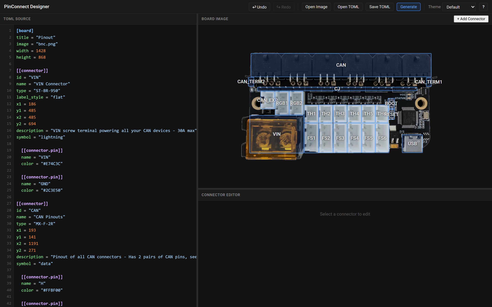
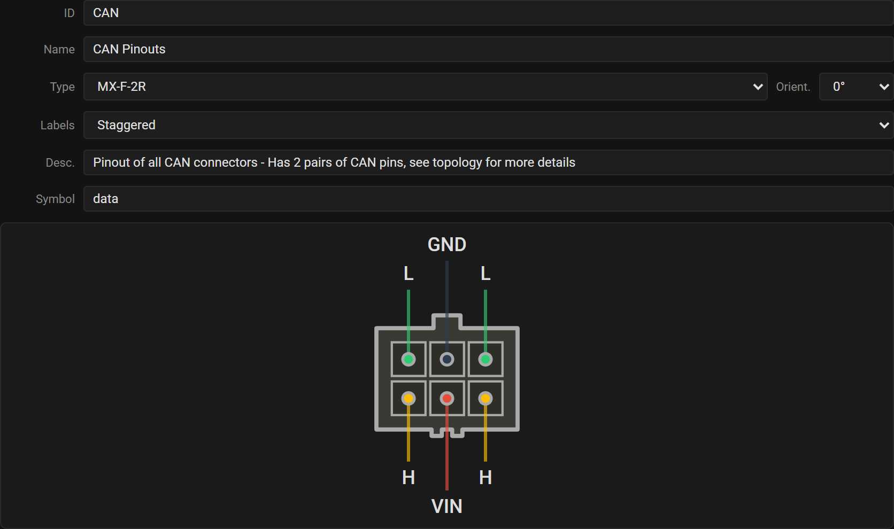
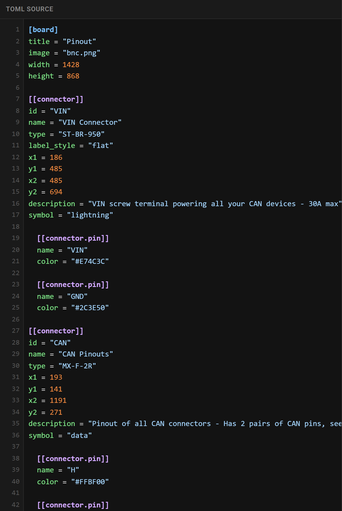
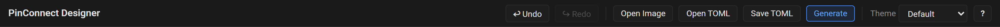

# The designer

The designer is where a board photo becomes a pinout. You load an image, draw a box over each connector, label the pins, and press Generate. It also writes a [board config](reference/board-toml.md) as you work, which you save so you can come back to the board later.

It runs the real generator in your browser rather than an imitation of it, so the preview is the file you download, and that file is identical to what the `pinout-gen` command produces from the same config.

## Running it

Use the hosted designer at **<https://pinconnect.isiks.tech>**. Nothing is uploaded: your photo and your config stay in the browser.

To run it yourself, install the tool and start serve mode:

```bash
pip install ./pinout_gen
pinout-gen --serve
```

That picks a free port, opens a browser, and prints the address. Add `--serve 8000` to choose the port, or `--no-browser` to leave the browser alone.

The designer must be served over HTTP. It fetches its runtime at startup, so opening `index.html` from disk does not work.

## The interface



A toolbar across the top, and three panels whose dividers you can drag:

- **Toolbar**: Undo, Redo, Open Image, Open TOML, Save TOML, **Generate**, a **Theme** selector, and **?** for the About box.
- **TOML Source** (left): a live, editable view of the config. Edits here update the diagram, and every visual change updates the text.
- **Board Image** (top right): your photo with connector boxes over it, and the **+ Add Connector** button.
- **Connector Editor** (bottom right): fields and pin list for the selected connector.

While the runtime is still starting, the toolbar shows its progress and **Generate** and **+ Add Connector** are disabled. Loading a photo works straight away.

The **Theme** selector sets the board's `theme`, which controls the colors, fonts and layout of the generated page, including the housing, cavity, outline and label colors of the connector drawings. The connector *shapes* do not change. The designer's own chrome keeps its fixed dark colors whichever theme you pick; to see a theme, use Generate. See [Themes](reference/themes.md).

## Workflow

### 1. Load a board image

Click **Open Image** and choose your photo, taken top-down. It sets the coordinate space for everything you place on it.


### 2. Add connectors

Click **+ Add Connector** (it becomes **Cancel Draw**), then drag a box over a connector. Releasing the drag opens the **New Connector** dialog, where you set the **ID** (one is suggested; it must be unique and non-empty), an optional **Name** (defaults to the ID), and the **Type**. Click **Create** to place it, or **Cancel** to discard the box. Very small boxes are ignored, so drag a real rectangle rather than clicking.

Draw mode switches off after each connector, so click **+ Add Connector** again for the next.


In the board panel you can:

- **Select** a connector by clicking its box.
- **Move** it by dragging.
- **Resize** it using the handles on a selected box.
- **Delete** the selected connector with the `Delete` key, which is ignored while you are typing in a text field.
- **Zoom** with the mouse wheel, centered on the cursor, and **pan** by dragging with the middle or right mouse button, to line boxes up precisely.

### 3. Edit the connector

With a connector selected, the **Connector Editor** shows:

- **ID**: unique identifier.
- **Name**: the label shown on the diagram.
- **Type**: the connector type, which drives the rendered shape.
- **Orient.**: rotation, one of 0°, 90°, 180° or 270°.
- **Labels**: flat, staircase or staggered pin labels on horizontal connectors, to avoid overlaps.
- **Desc.**: an optional longer description.
- **Symbol**: an optional icon beside the connector in the generated list and tooltip. A named icon such as `power` or `fan`, a literal glyph, or `none`. The field suggests the built-in names as you type. See [`symbol`](reference/board-toml.md#symbol).

The preview underneath is drawn by the generator, so it is exactly the shape the finished pinout will contain.



### 4. Edit the pins

The **Pins** section lists the connector's pins in order:

- **+ Add Pin** appends a pin.
- Edit each pin's **name** inline.
- Click the **color swatch** for a preset or a custom hex value.
- Set the **row** (R1 / R2) on two-row connector types.
- **Reorder** by dragging the handle.
- **Delete** with the × button.

Pin order in the list is the physical pin order in the output.


### 5. Edit the TOML directly (optional)

The **TOML Source** pane is fully editable, and the two directions stay in step: type there and the diagram updates, change something visually and the text updates. Useful for bulk edits or pasting in a config you already have.

Your comments and formatting survive. The designer patches the specific lines it needs rather than rewriting the file.



### 6. Generate the pinout

Click **Generate**. The dialog renders the pinout and shows the real page, not an approximation.


- **Theme** re-renders with any of the built-in themes, so you can compare before committing.
- **Embed image** writes the board photo into the HTML. On, you get one self-contained file. Off, the file is far smaller but needs the photo beside it. The size beside the toggle is the size of what you are about to download.
- **Download** saves the page as `<image name>.pinout.html`.

If the config cannot be rendered, the dialog shows why and Download is disabled until it can.

### 7. Save the config

Click **Save TOML**, and keep the file with your board photo.

The pinout you downloaded is finished and standalone, so this is not for it. It is for the next revision of the board: **Open TOML** loads the config back in, **Open Image** brings back the photo, and you carry on from where you left off.

If you close or reload the tab with changes you have not saved, the browser asks you to confirm first. It compares against the last config you saved or opened, so opening one and closing again straight away does not ask.



## Keyboard shortcuts

| Shortcut | Action |
| --- | --- |
| `Ctrl+Z` | Undo |
| `Ctrl+Y` or `Ctrl+Shift+Z` | Redo |
| `Ctrl+S` | Save TOML |
| `Delete` | Delete the selected connector |

Use `Cmd` in place of `Ctrl` on macOS. Undo and Redo are also toolbar buttons. `Delete` is ignored while you are typing in a text field, and all of these are ignored while a dialog is open.

## Troubleshooting

### "Renderer unavailable" in the toolbar

The designer downloads its Python runtime from `cdn.jsdelivr.net` on first load. If that host is blocked by a network policy, an extension or an offline machine, nothing can render: **Generate** and **+ Add Connector** stay disabled and connectors show as "Unknown type" instead of drawings.

Allow `cdn.jsdelivr.net`, or use the [command line tool](automating.md), which needs no network at all. Hover the message for the underlying error.

### The connector types I need are missing

The designer offers the connector types bundled with PinConnect. It cannot read a type you have written into a board's own `connector_dir`, because that folder is on your disk and the designer only has the config text.

Such a board still renders, but **with the bundled definition of any type whose name it shares**, which is not what `pinout-gen` would produce. The Generate dialog says so when it happens. Render those boards with the command line tool, and see [connector types](reference/connector-types.md) for adding a type to the bundled library instead.

The same applies to a theme in a board's own `theme_dir`.

### The board image is missing from the downloaded page

You turned **Embed image** off, which leaves the page loading the photo from beside it by the path in the config. Either keep the two files together, or download again with the toggle on.
