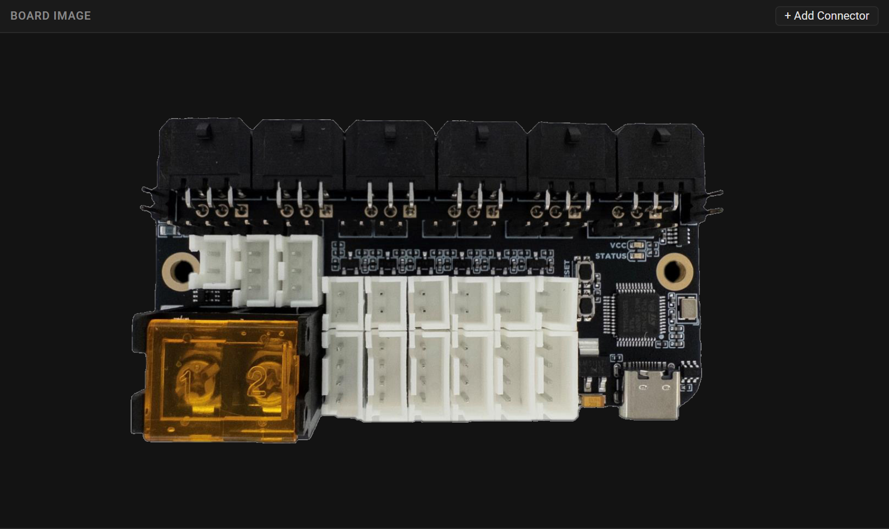
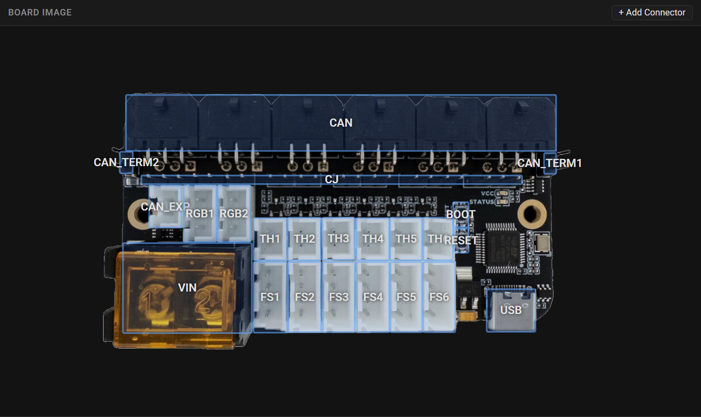
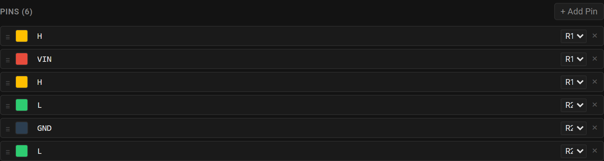
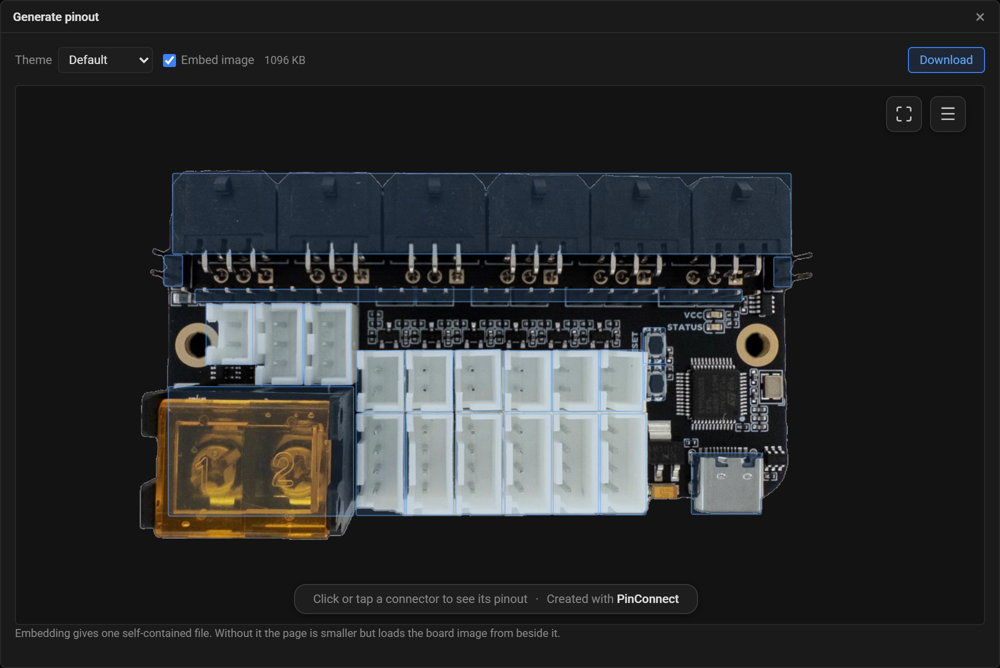
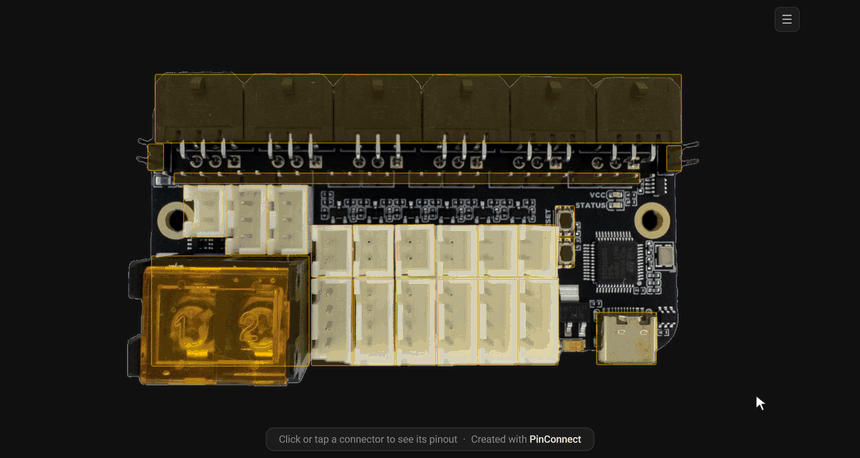

# Getting Started

This guide takes you from a photo of your board to a finished interactive pinout. It happens entirely in your browser and takes about five minutes.

## What you need

- A **top-down photo** of your board, in any format a browser can display.
- A browser. Nothing else: the designer downloads what it needs and runs the generator itself, so there is no install step.

The first load fetches a Python runtime of roughly 10 MB, which takes a few seconds and is then cached. The toolbar tells you when it is ready.

## Step 1: Open the designer

Go to **<https://pinconnect.isiks.tech>**.

If you have cloned the repository and would rather run it yourself, install the tool and use its serve mode instead:

```bash
pip install ./pinout_gen
pinout-gen --serve
```

That builds what the designer needs, starts a local server, and opens a browser. See [Automating](automating.md) for the details.

## Step 2: Load your board photo

Click **Open Image** and choose your photo. It sets the coordinate space for everything you place on top of it.



## Step 3: Draw a box over each connector

Click **+ Add Connector**, then drag a box over a connector in the photo. Releasing the drag opens a dialog where you give the connector an ID, an optional name, and a type from the built-in library.

Draw mode switches itself off after each connector, so click the button again for the next one.



## Step 4: Label the pins

Select a connector to edit it. Set its type, orientation and description, then name each pin and give it the color of the wire that goes there.

Pin order in the list is the physical pin order in the output, so drag the handles until they match the board.



[The designer](designer.md) covers every field in detail.

## Step 5: Generate

Click **Generate**. The dialog renders your pinout and shows it exactly as it will look.



Two controls are worth knowing:

- **Theme** changes the colors, fonts and layout of the finished page. Six are built in. Switch between them to see the effect immediately, and read [Themes](reference/themes.md) to write your own.
- **Embed image** decides whether the board photo is written into the HTML. Leave it on and you get one self-contained file that works anywhere. Turn it off and the file is much smaller, but the photo has to sit beside it.

Click **Download** to save the page. Open it in a browser and you have this:



## Step 6: Save the config too

Click **Save TOML** to keep the config the designer has been writing as you work.

You do not need it for the pinout you just downloaded, but you will want it the next time the board changes: load it back with **Open TOML**, adjust, and generate again. Rebuilding a board from scratch because the config was not saved is the one avoidable mistake here.

The designer does not auto-save, and closing the tab discards unsaved work without warning.

## Where to go next

- [The designer](designer.md): every panel and field, plus what to do when something looks wrong.
- [Concepts](concepts.md): what the config actually describes, and how connector types and themes are resolved.
- [Automating](automating.md): regenerate pinouts from the command line, or from CI.
- [Embedding](embedding.md): put the pinout into an MkDocs or Zensical page.
