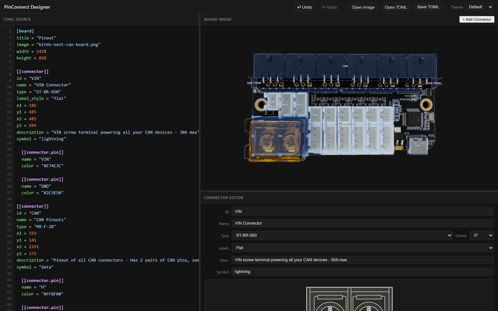
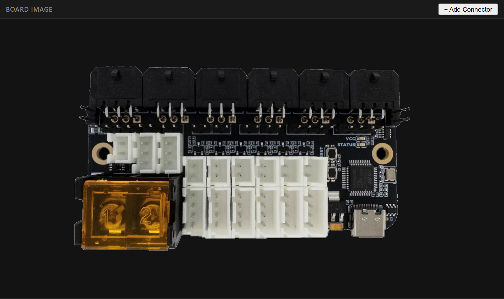
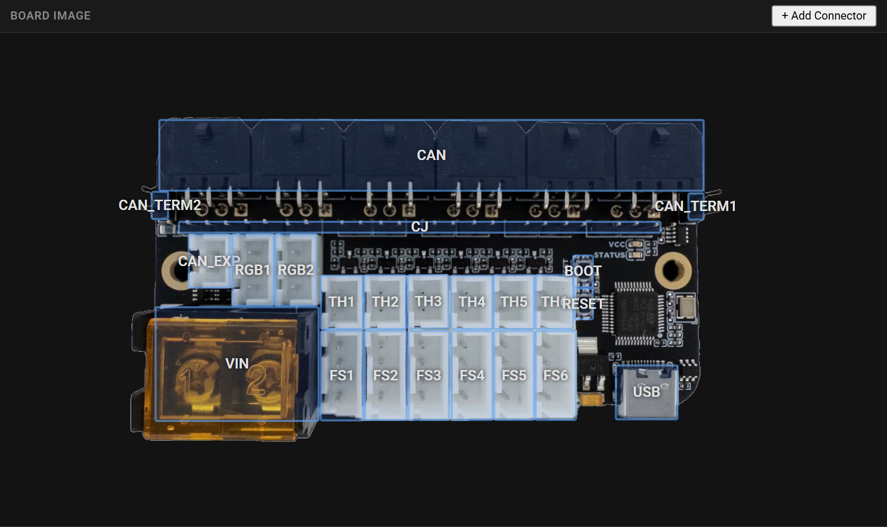
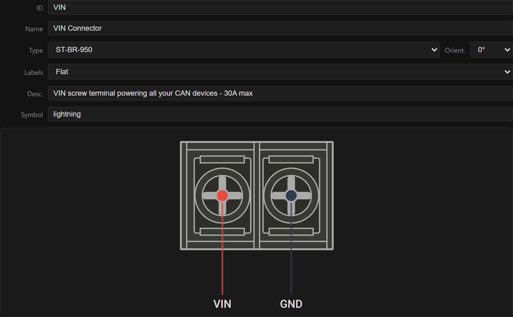
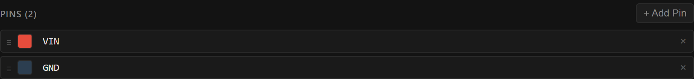
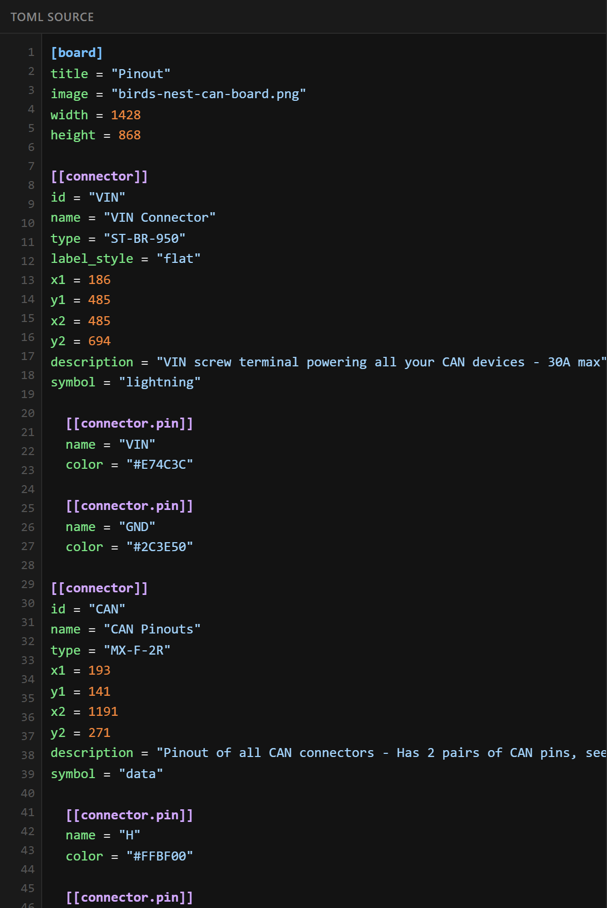
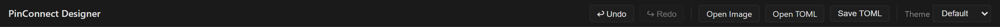

# pinout-design

The designer is a browser-based tool for building a [board TOML config](pinout-gen/board-toml.md) visually. You load a board image, draw a box over each connector, label the pins, and the tool writes the TOML for you. It is a static web app so there is nothing to install.

## Running the designer

The designer reads its connector library over `fetch()`, so it must be served over HTTP. Opening `index.html` directly with `file://` will not work.

Start a local server from the `pinout_design` folder:

**PowerShell**

```powershell
cd pinout_design
python -m http.server 8000
```

**Linux / macOS**

```bash
cd pinout_design
python3 -m http.server 8000
```

Then open <http://localhost:8000> in your browser. Stop the server with `Ctrl+C` (on the terminal) when you are done.

## The interface



The window has a toolbar across the top and three panels:

- **Toolbar**: Undo, Redo, Open Image, Open TOML, Save TOML, and a **Theme** selector.
- **TOML Source** (left): a live, editable view of the config. Edits here update the diagram, and vice versa.
- **Board Image** (top right): your board photo with connector boxes overlaid. Has an **+ Add Connector** button.
- **Connector Editor** (bottom right): fields and pin list for the currently selected connector.

The panel dividers can be dragged to resize.

The **Theme** selector sets the board's `theme` — the colours, fonts, and behaviours `pinout-gen` applies *around* the connectors (the connector diagrams themselves look the same). It lists the bundled themes; a custom theme name you type into the TOML is preserved and shown too. See [themes](pinout-gen/themes.md) for what a theme controls and how to make your own.

## Workflow

### 1. Load a board image

Click **Open Image** and choose your board photo (PNG or JPG, top-down). The image sets the coordinate space for everything you place on it.



### 2. Add connectors

Click **+ Add Connector** (the button switches to **Cancel Draw**), then drag a box over a connector on the image. Release to create it. Repeat for each connector; click **Cancel Draw** to leave draw mode.



In the board panel you can:

- **Select** a connector by clicking its box.
- **Move** it by dragging.
- **Resize** it using the handles on a selected box.
- **Zoom** with the mouse wheel and **pan** by dragging the background, to line boxes up precisely.

### 3. Edit the connector

With a connector selected, the **Connector Editor** shows:

- **ID**: unique identifier.
- **Name**: label shown on the diagram.
- **Type**: connector type, chosen from the built-in library (drives the rendered shape).
- **Orient.**: rotation: 0°, 90°, 180°, or 270°.
- **Labels**: flat, staircase or staggered layout of pin labels on horizontal connectors (avoids overlaps).
- **Desc.**: optional longer description.
- **Symbol**: optional icon shown beside the connector in the generated pinout's list and tooltip — a named icon (`power`, `fan`, …), a literal glyph, or `none`. The field suggests the built-in names as you type. See [`symbol`](pinout-gen/board-toml.md#symbol).

A small preview shows the selected connector type as it will render.



### 4. Edit the pins

The **Pins** section lists the connector's pins in order. You can:

- Click **+ Add Pin** to append a pin.
- Edit each pin's **name** inline.
- Click the **color swatch** to pick a color — either a preset (Red, Black, Yellow, Blue, Green, Gray, White, Orange, Purple, Teal) or a custom hex value.
- Set the **row** (R1 / R2) for two-row connector types.
- **Reorder** pins by dragging the handle (≡).
- **Delete** a pin with the × button.

Pin order in the list is the physical pin order in the output.



### 5. Edit the TOML directly (optional)

The **TOML Source** pane is fully editable. Anything you type there updates the diagram live, and any change you make in the visual panels updates the text. This is handy for bulk edits or pasting in an existing config.



### 6. Save

Click **Save TOML** to download the config. Save it next to your board image so `pinout-gen` can find the image later.



To resume work, use **Open TOML** to load a config back in, and **Open Image** to reload its board image.

## Undo / redo

Use the **Undo** and **Redo** toolbar buttons (or `Ctrl+Z` / `Ctrl+Y`) to step through your changes.

## After the designer

The designer produces the TOML needed for `pinout-gen`, it doesn't generate the interactive pinout itself. Once you have saved the config, continue with [pinout-gen](pinout-gen/generating-html.md) to render the HTML.

## Adding new connector types

The type dropdown is populated from JSON files in `pinout_design/connectors/`, which are generated from the canonical TOML type definitions. If a type you need is missing, see [connector types](pinout-gen/connector-types.md) for how to add one and regenerate the designer's JSON.
